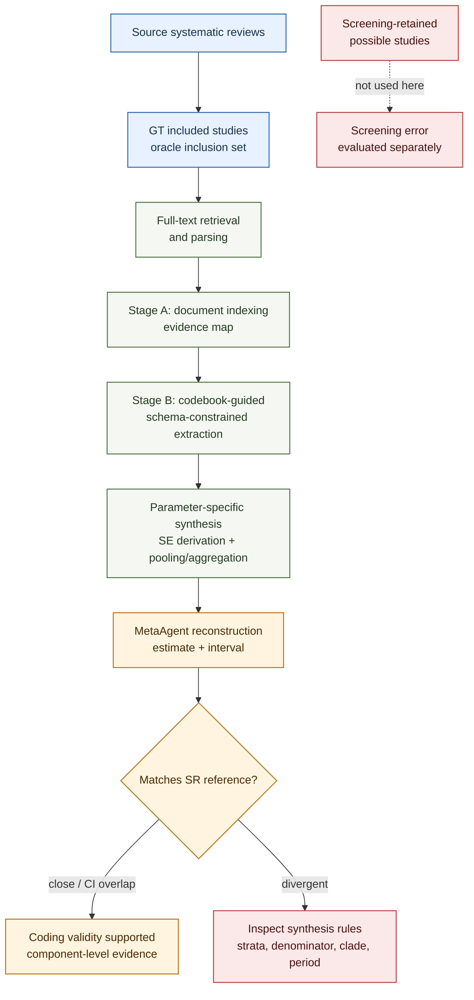

# Mpox Controlled Coding Validation

Flowchart showing the GT-only component-level validation design used to isolate full-text coding from upstream screening error propagation.

```mermaid
flowchart TB
    A["Source systematic reviews"] --> B["GT included studies<br/>oracle inclusion set"]
    S["Screening-retained<br/>possible studies"] -. "not used here" .-> N["Screening error<br/>evaluated separately"]

    B --> C["Full-text retrieval<br/>and parsing"]
    C --> D["Stage A: document indexing<br/>evidence map"]
    D --> E["Stage B: codebook-guided<br/>schema-constrained extraction"]
    E --> F["Parameter-specific synthesis<br/>SE derivation + pooling/aggregation"]
    F --> G["MetaAgent reconstruction<br/>estimate + interval"]
    G --> H{"Matches SR reference?"}
    H -->|"close / CI overlap"| I["Coding validity supported<br/>component-level evidence"]
    H -->|"divergent"| J["Inspect synthesis rules<br/>strata, denominator, clade, period"]

    classDef input fill:#e8f1ff,stroke:#3b6ea8,stroke-width:1.4px,color:#17324d;
    classDef process fill:#f4f7f2,stroke:#587b4d,stroke-width:1.4px,color:#263a22;
    classDef output fill:#fff4df,stroke:#b7791f,stroke-width:1.4px,color:#4a2b00;
    classDef caution fill:#fbe8e8,stroke:#b94a48,stroke-width:1.4px,color:#4a1111;

    class A,B input;
    class C,D,E,F process;
    class G,H,I output;
    class S,N,J caution;
```
